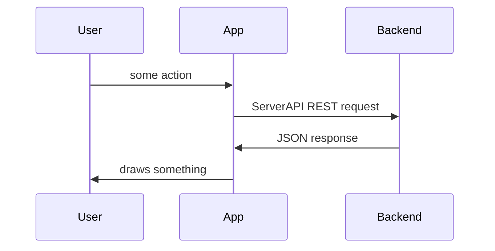
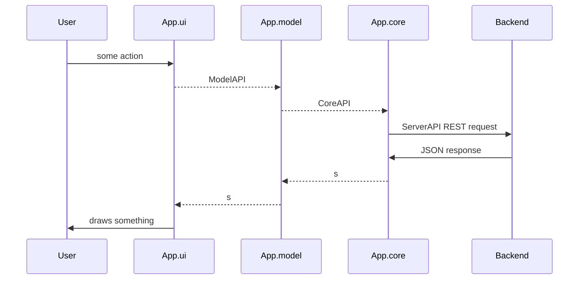
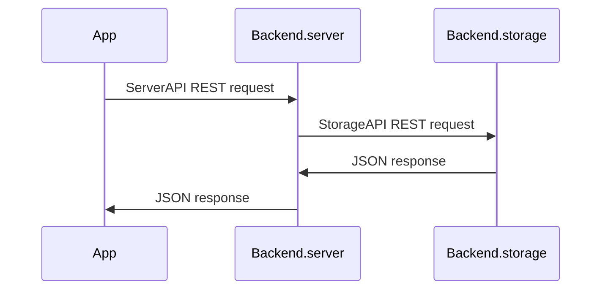

# Modular structure
Main idea is to separate parts of whole application so that it would be easy to develop them independently.

## Top level - ServerAPI
ServerAPI separates App from Backend, App must have config for server so that it would be easy to change it.


## App level - ModelAPI and CoreAPI
What App does (and how)?
App provides User with some **model** of his data.
To build a **model** app uses **core** as a basic system to access data.
And User is provided with interface - **ui**.
So App consists of several modules:


## Backend level
Backend.server - public server - authorization, authentication, balancing, caching, different interfaces: http, https, web socket (+additional functionality?)
Backend.storage - protected server (local?) - access to data
Two servers seems the easiest way to completely separate these two modules.


## Profit
We can choose and develop quite independently any part of chain **ui.model.core.server.storage** in application we'd like to make better.
We can build different applications changing only **ui + model**.
We can play with any application installing locally any **server + storage** we like.
We can have different hostings for different applications or run all of them on one server.

# Building a model
There are several basic objects: *Node*, *Relation*, *Access*
This API should provide enough tools for building all features, but remain small and clear - this is crucial.

## Objects
### Node
Every data is a *Node*, field **type** tells what.
User is a *Node*, all it creates is a *Node*.
TODO what if all is encrypted?
TODO do something with flags
In case of encryption **title**, **content**, **meta** and all **relations** are encrypted  
* string **id**
* string **author**
* string **type**
* string **title**
* string **contentType**
* binary **content**
* int **flags** - some bits
* string **meta** - json string
* Relation[] **relations**

### Relation
*Relation* is a connection to other *Node* and contained in a *Node*.
*Node* cannot relate to itself.
To build a *Relation* one needs access to both *Nodes*.
*Node* can have multiple *Relations* - different kind of objects: tags, images, etc.
*Relation* used in a *Node* can have a **local_title** covering title of related *Node*, for example we have a *Node* of type='note' with text: 'It was amazing show when _Bobby jumped from the balcony to a snow hill_ below.', we could hide a picture of Bobby jumping from the balcony under those words, and that _italic_ text could be a reference, while in another note we could reference to the same picture with some other text.
*Relation* used in a *Node* may have a **local_value**, a number if the *Relation* has idea of it, for example for text 'Seen Lamborghini in a street, think it costs about 300 000 $' we could save relation 'price' with value '300000'.
* string **type** - related Node.type
* string **id** - related Node.id
* string **local_title** - local synonym for related Node that can be used in this Node
* string **local_value** - local value for relations that carry a number, for example: weight

### Access
*Node* can have *Access* to other *Node*, that's direct access.
There is also indirect access, when *Node_A* relates to *Node_B* and *Node_B* has direct access to *Node_C* then *Node_A* has access to *Node_C*, same as *Node_B*.
So if *Node* allows to relate to it, it gives access to all *Nodes* accessible for it.  
If *Node_A* has direct access to *Node_C*, then only direct rights are applied.
If *Node_A* has no direct access and has multiple indirect accesses to *Node_C*, then indirect rights are summarized.
To change *Access* between *Node_A* and *Node_B* on needs rights 'create access from' *Node_A* and 'create access to' *Node_B*.
* string **idA** - object that has access
* string **idB** - object that is accessed
* string **rights** - bits `<create access from><create access to><delete><write><relate><read>`

## StorageAPI
It is REST API

### Get Nodes
TODO throws ErrCode
TODO paging
GET /node/<**nodeId**>?user=<**userId**> - to get one particular *Node*
or for common case of multiple get or search
GET /node?user=<**userId**>&id=<**nodeIds**>&type=<**types**>&titleRegexp=<**titleRegexp**>

string[][] getNodes (**userId**, **ids**, **types**, **titleRegexp**, **relationsFilterIn**, **relationsFilterOut**, **responseFields**)
returns array with length = responseFields.length * num of results
Returned will be *Nodes* for which user has access 'read'.
If **ids** were in request and user doesn't have access to even one *Node* then request fails with error.
* string **userId**
* string[] **ids** - [] means 'all'
* string[] **types** - [] means 'all'
* string **titleRegexp**
* string[] **relationsFilterIn** - [] means 'all'. [<type1>, <f1_id>, <f1_val_min>, <f1_val_max>, <f2>, ..., <type2>, ...] length = 4*N
* string[] **relationsFilterOut** - [] means 'none'. [<type1>, <f1_id>, <f1_val_min>, <f1_val_max>, <f2>, ..., <type2>, ...] length = 4*N
* string[] **responseFields** - [] means 'all'

### Edit Node
TODO throws ErrCode
POST /node/<**nodeId**>?user=<**userId**>&operation=<**operation**>

Parameters:
* string **nodeId** - is null only if it is new Node
* string **userId**
* int **operation** - bits telling what to update `<relations><meta><flags><content><title><delete>`

Request body fields:
* string **type**
* string **title**
* string **content**
* int **flags**
* string **meta**
* string **relationsAdd** - ["<id1>", "<local_title1>", <local_value1>, "<id2>", ...] length = 3*N
* string **relationsRm** - ["<id1>", "<id2>", ...]

When *Node* is new, creates full access to new *Node*. User needs access 'relate' to modify relations.
Example:
`/node/dalmatianNodeId?userId=Joe&operation=62 HTTP/1.1` body in `examples/POST_node.txt`

### Get Access
TODO throws ErrCode
int getAccess (**userId**, **idA**, **idB**)
returns bits `<create access from><create access to><delete><write><read>`
* string **userId**
* string **idA** - *Node* with access
* string **idB** - resource *Node*

### Edit Access
editAccess (**userId**, **idA**, **idB**, **rights**)
TODO throws ErrCode
User gives *Node A* access to *Node B*, only if user has access 'create access to' to *Node B* and 'create access from' to *Node A*
* string **userId**
* string **idA** - *Node* with access
* string **idB** - resource *Node*
* string **rights** - bits `<create access from><create access to><delete><write><relate><read>`

## Example scenarios
TODO actualize examples
### Adding node with inline tags and a file
1. User
    1. writes title 'Dalmatin'
    2. writes text 'Seen a #dog in a #park today'
    3. loads a picture
    4. presses 'save'
2. App
    1. finds tags in text 'dog' and 'park'
    2. finds tag 'park' that is [parkTagId, 'park']
    ```
    findNodes(userId, [], ['tag'], 'park', [], [])
    or
    findNodes(userId, [], ['tag'], '^park$', [], [])
    ```
    3. creates tag
    ```
    dogTagId = editNode(
        userId,
        null,
        'tag',
        111110,
        'dog',
        <binary dog text>,
        10,
        dogTagMeta,
        [],
        []
    )
    ```
    4. creates image
    ```
    dogImageId = editNode(
        userId,
        null,
        'image',
        111110,
        dogImageTitle,
        <binary image content>,
        00,
        dogImageMeta,
        [],
        []
    )
    ```
    5. creates node with relations
    ```
    dogNodeId = editNode(
        userId,
        null,
        'note',
        111110,
        'Dalmatin',
        <binary node text>,
        10,
        newNodeMeta,
        ['tag', dogTagId, 'dog', null, 'tag', parkTagId, 'park', null],
        []
    )
    ```

### Renaming a tag
When user renames tag 'dog' to 'dogs' in list of tags record [dogTagId, 'dog'] changes to [dogTagId, 'dogs']. It allows existing inline tags remain same and be used more times in a node where they are already present. In nodes without tag 'dog' user now will be able to use tag 'dogs'.

## Questions
C++ compatible API -
Full text search -
Sharding of data -
Indexing of data -
