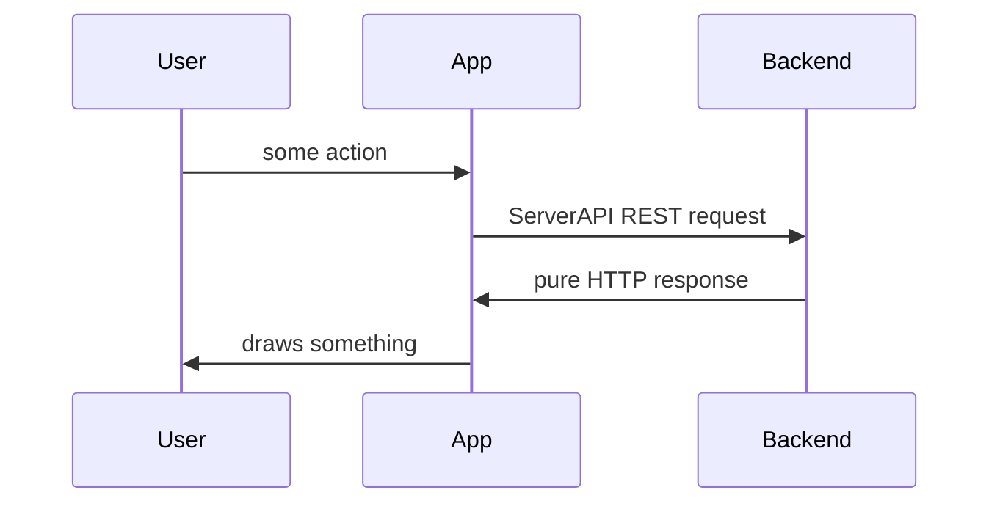
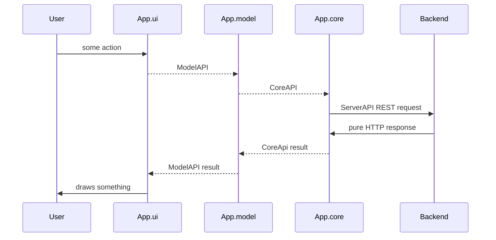
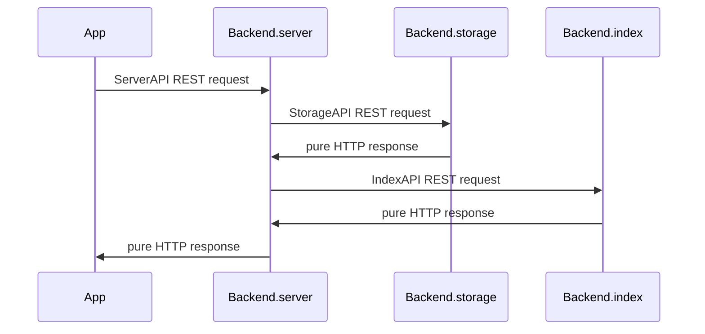
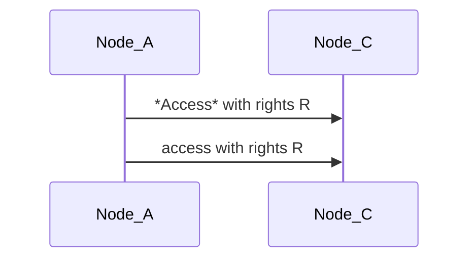
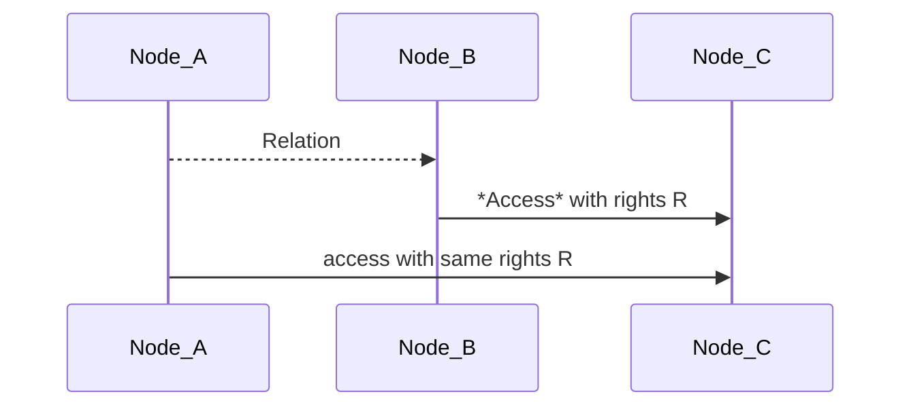
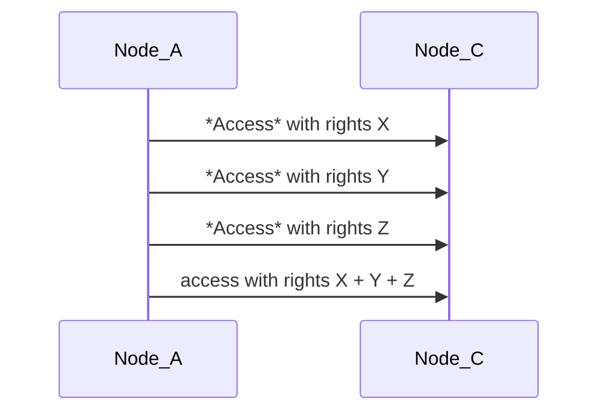
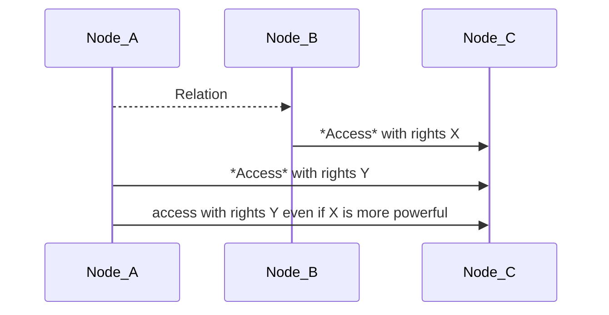

# Modular Notes
At first this project is an attempt to build a notes taking application with lots of different builds:
* application can be easily implemented using some *core*
* what application does doesn't depend on backend, logic is defined in a *model*

That obviously leads to possibilities:
* to have multiple different applications over same data, comparing them, switching from one to another if they share the logic
* to migrate data to another server since they all implement same API

So I need:
1. Whole application to be separated into highly independent modules.
2. Simple idea how to store pieces of data and connections between them.
3. Implement all modules as simple as possible for a playground and demo.
4. Implement some modules differently (especially UI) to show how it can be customized.

# Modules of an Application
Frontend we call App, backend is Backend. Lets dive in those two.

## Top level - ServerAPI
ServerAPI separates App from Backend  
App must have config for server so it would be easy to switch to any other server

## App level - Model and Core
What does any application do? It provides User with some model of his data. It takes User's data and keeps in some structure. **Model** contains that logic.  
And the logic can be built on some low level system and that is what **Core** is - basic access system for data.  
And User is provided with some interface - **UI**.  
So App consists of several modules:

## Backend level
Backend.server - public server - provides authorization, authentication, balancing, caching, and different interfaces: http, https, web socket (+additional functionality?)  
Backend.storage - protected server (local?) - provides only access to data with basic indexing.  
Backend.index - protected server - provides additional index for data, especially for **content**.  
Http servers seems the easiest way to completely separate these modules.  

## Modules
[Storage](docs/STORAGE.md)
[Index](docs/INDEX.md)
[Server](docs/SERVER.md)
[Core](docs/CORE.md)
[Model](docs/MODEL.md)

## Profit
We can choose and develop quite independently any part of chain **ui.model.core.server.storage** in application we'd like to make better.  
We can build different applications changing only **ui + model**.  
We can play with any application setting up locally any **server + storage + index** we like.  
We can have different servers for different applications or run all of them on one server or we can have different servers for one application and sync data between them.  

# Basic idea of data model
There are several basic objects: Node, Relation, Access

## Objects
### Node
Every data is a *Node*, field **class** tells what.
User is a *Node*, all it creates is a *Node*.
* int **id** - unique serial integer being assigned to *Node* on create
* int **author** - id of User who created this *Node*
* string **class** - one word
* string **title** - text
* string **ctype** - MIME content type?
* binary **content** - anything
* int **flags** - some bits, `...<title is encrypted><content is encrypted>`
* string **meta** - json string
* Relation[] **relations**

### Relation
Relation is a connection to other Node and contained in a Node.  
Node cannot relate to itself.  
To build a Relation one needs access to both Nodes.  
Node can have multiple Relations - different kinds of objects: tags, images, etc.  
Relation used in a Node can have a **local_title** covering title of related Node, for example we have a Node of class='note' with text: 'It was amazing show when _Bobby jumped from the balcony to a snow hill_ below.', we could hide a picture of Bobby jumping from the balcony under those words, and that _italic_ text could be a reference, while in another note we could reference to the same picture with some other text.  
Relation used in a Node may have a **local_value**, a number if the Relation has idea of it, for example for text 'Seen Lamborghini in a street, think it costs about 300 000 $' we could save relation 'price' with value '300000'.
* string **class** - related Node class
* int **id** - related Node id
* string **local_title** - local synonym for related Node that can be used in this Node
* number **local_value** - local value for relations that carry a number, for example: weight

### Access
*Access* is an object containing access rights from one *Node* to another *Node*
* int **idA** - object that has access
* int **idB** - object that is accessed
* int **rights** - bits `<create access from><create access to><delete><write><relate><read>`

#### Direct
*Node* can have *Access* to other *Node*, that's direct access.

#### Indirect
There is also indirect access, when *Node_A* relates to *Node_B* and *Node_B* has direct access to *Node_C* then *Node_A* has access to *Node_C*, same as *Node_B*.  

So if *Node* allows to relate to it, it gives access to all *Nodes* accessible for it.

#### Composition of indirect Accesses
If *Node_A* has no direct access and has multiple indirect accesses to *Node_C*, then indirect rights are summarized.

#### Composition of direct and indirect Accesses
If *Node_A* has direct access to *Node_C*, then only direct rights are applied.

#### Change Access
To change *Access* between *Node_A* and *Node_B* User needs rights 'create access from' *Node_A* and 'create access to' *Node_B*.

## Questions
C++ compatible API - TODO
Indexing of data - Backend.index
Full text search - Backend.index
Content recognition search - Read all, set recognized tags, find by these tags
