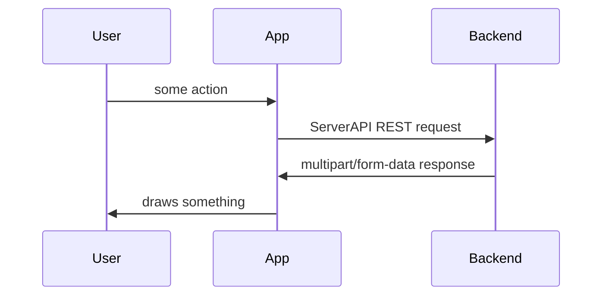
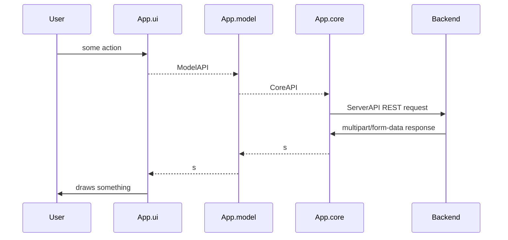
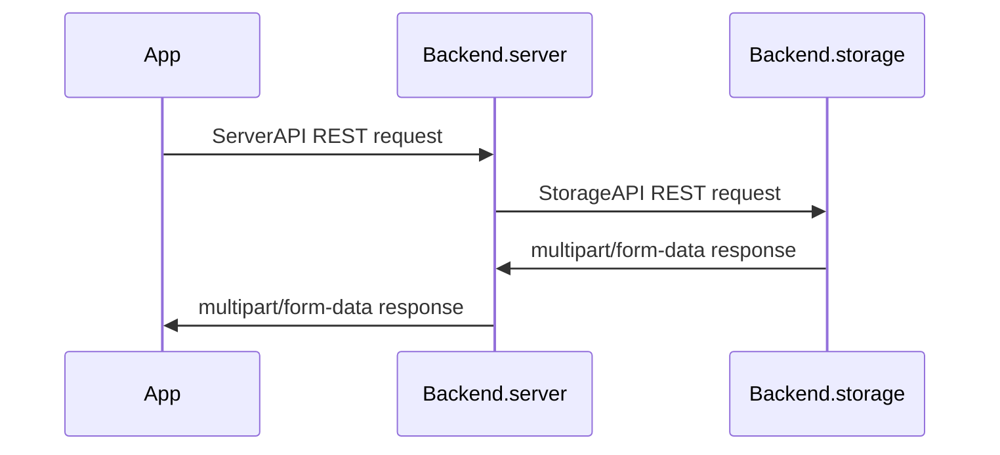
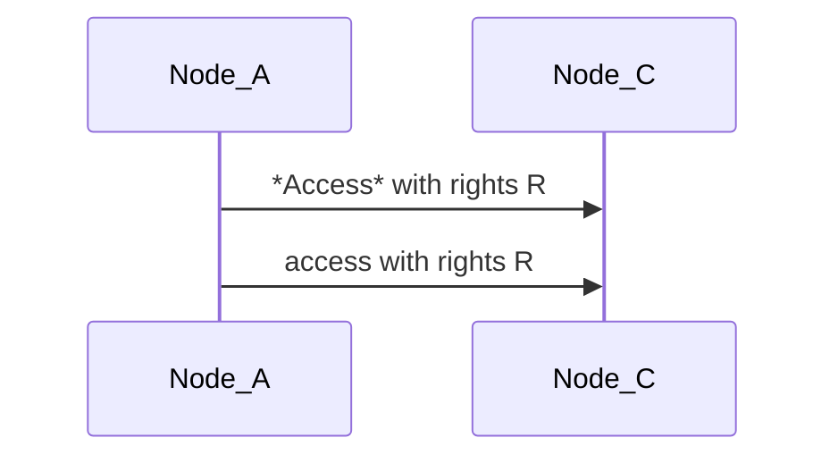
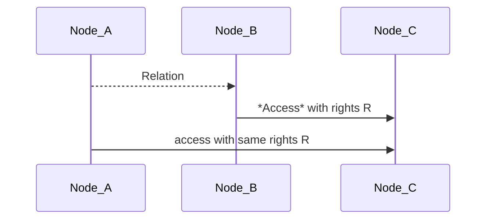
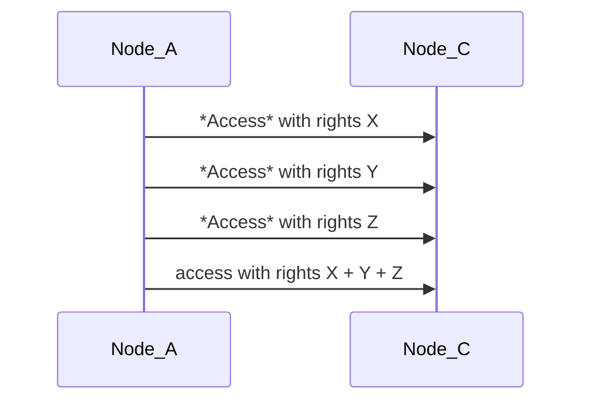
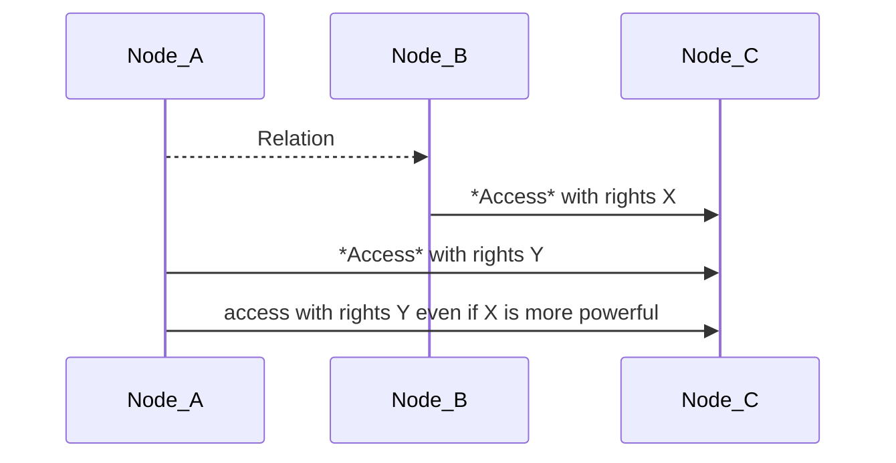

# Modular Notes
This project is an attempt to build a notes taking application with two main properties:
1. Whole application is separated into highly independent modules
2. It utilizes simple system for operating data built on idea how to store pieces of data and connections between them.

# Modules of an Application
Frontend we call App, backend is Backend. Lets dive in those two.

## Top level - ServerAPI
ServerAPI separates App from Backend, App must have config for server for it would be easy to switch to any other available server and App continues to run. Later we'll think about migration tool, it should be quite easy since all servers will have same api.

## App level - ModelAPI and CoreAPI
What does any App do is it provides User with some **model** of his data. It takes user's data and keeps in some structure.
This structure may be built on some low level system and that is what **core** is - basic access system for data.
And finally User is provided with interface - **ui**.
So App consists of several modules:

## Backend level
Backend.server - public server - provides authorization, authentication, balancing, caching, and different interfaces: http, https, web socket (+additional functionality?)
Backend.storage - protected server (local?) - provides only access to data
Two http servers seems the easiest way to completely separate these two modules.

## APIs
[StorageAPI](docs/STORAGE_API.md)
[ServerAPI](docs/SERVER_API.md)
[CoreAPI](docs/CORE_API.md)
[ModelAPI](docs/MODEL_API.md)

## Profit
We can choose and develop quite independently any part of chain **ui.model.core.server.storage** in application we'd like to make better.
We can build different applications changing only **ui + model**.
We can play with any application setting up locally any **server + storage** we like.
We can have different servers for different applications or run all of them on one server or we can have different servers for one application and sync data between them.

# Basic idea of data model
There are several basic objects: *Node*, *Relation*, *Access*

## Objects
### Node
Every data is a *Node*, field **class** tells what.
User is a *Node*, all it creates is a *Node*.
TODO what if all is encrypted?
TODO do something with flags
In case of encryption **title**, **content**, **meta** and all **relations** are
* int **id** - unique serial integer being assigned to *Node* on create
* int **author** - id of User who created this *Node*
* string **class** - one word
* string **title** - text
* string **ctype** - MIME content type?
* binary **content** - anything
* int **flags** - some bits?
* string **meta** - json string
* Relation[] **relations**

### Relation
*Relation* is a connection to other *Node* and contained in a *Node*.
*Node* cannot relate to itself.
To build a *Relation* one needs access to both *Nodes*.
*Node* can have multiple *Relations* - different kinds of objects: tags, images, etc.
*Relation* used in a *Node* can have a **local_title** covering title of related *Node*, for example we have a *Node* of class='note' with text: 'It was amazing show when _Bobby jumped from the balcony to a snow hill_ below.', we could hide a picture of Bobby jumping from the balcony under those words, and that _italic_ text could be a reference, while in another note we could reference to the same picture with some other text.
*Relation* used in a *Node* may have a **local_value**, a number if the *Relation* has idea of it, for example for text 'Seen Lamborghini in a street, think it costs about 300 000 $' we could save relation 'price' with value '300000'.
* string **class** - related Node class
* int **id** - related Node id
* string **local_title** - local synonym for related Node that can be used in this Node
* number **local_value** - local value for relations that carry a number, for example: weight

### Access
*Access* is an object containing access rights from one *Node* to another *Node*
* int **idA** - object that has access
* int **idB** - object that is accessed
* int **rights** - bits `<create access from><create access to><delete><write><relate><read>`

#### Direct
*Node* can have *Access* to other *Node*, that's direct access.

#### Indirect
There is also indirect access, when *Node_A* relates to *Node_B* and *Node_B* has direct access to *Node_C* then *Node_A* has access to *Node_C*, same as *Node_B*.

So if *Node* allows to relate to it, it gives access to all *Nodes* accessible for it.

#### Composition of indirect Accesses
If *Node_A* has no direct access and has multiple indirect accesses to *Node_C*, then indirect rights are summarized.

#### Composition of direct and indirect Accesses
If *Node_A* has direct access to *Node_C*, then only direct rights are applied.

#### Change Access
To change *Access* between *Node_A* and *Node_B* User needs rights 'create access from' *Node_A* and 'create access to' *Node_B*.

## Questions
C++ compatible API -
Full text search -
Sharding of data -
Indexing of data -
