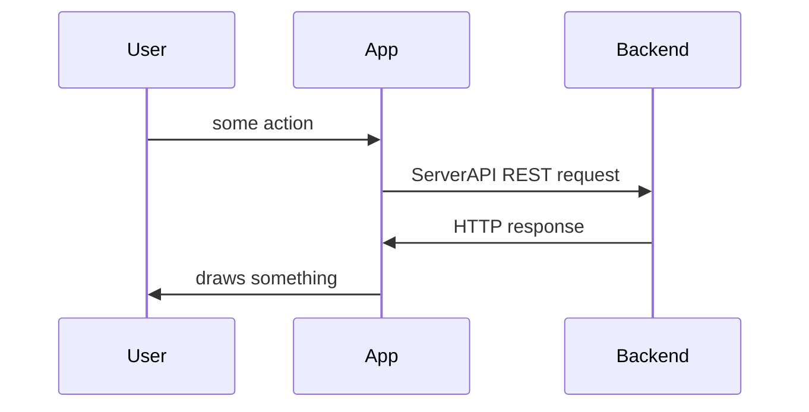
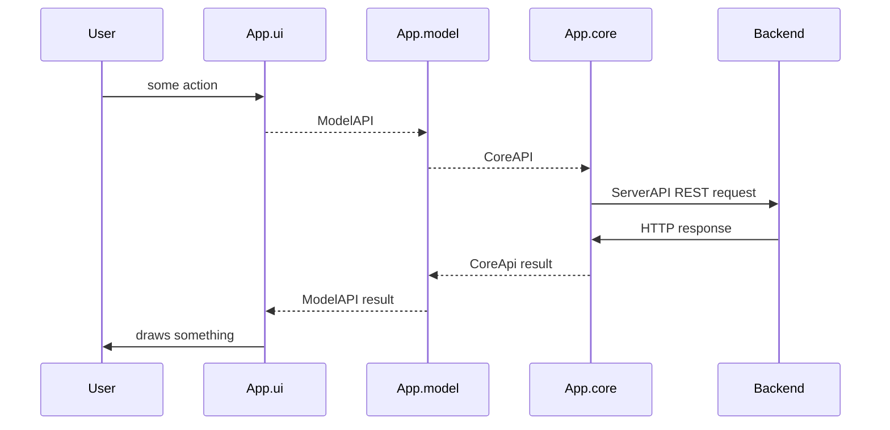
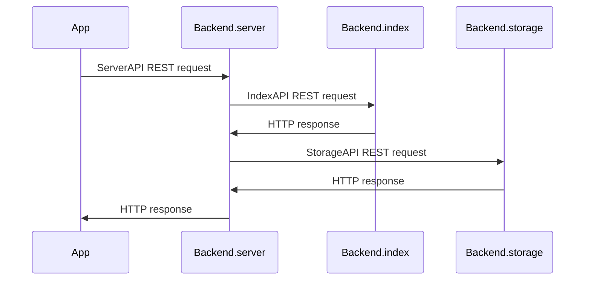
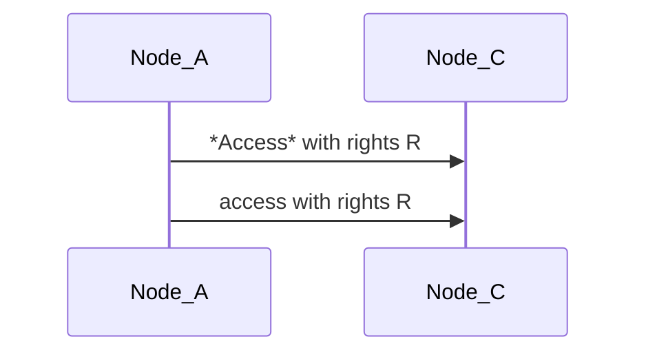
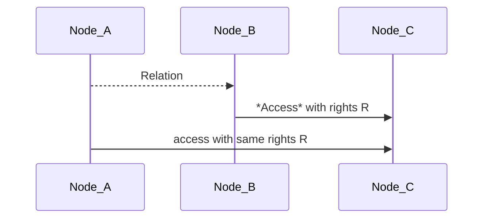
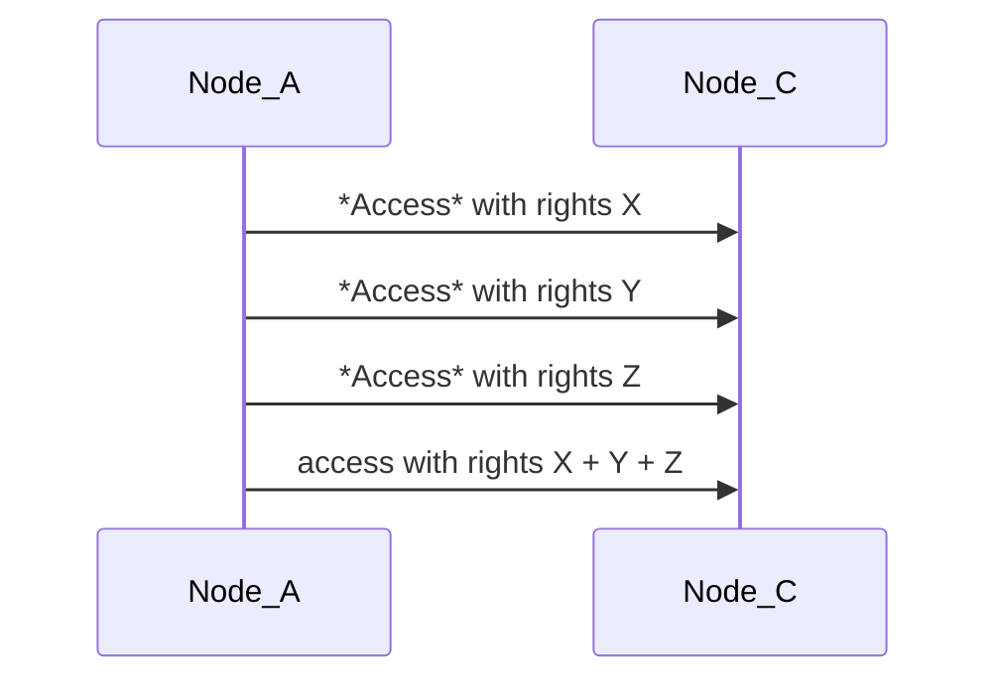
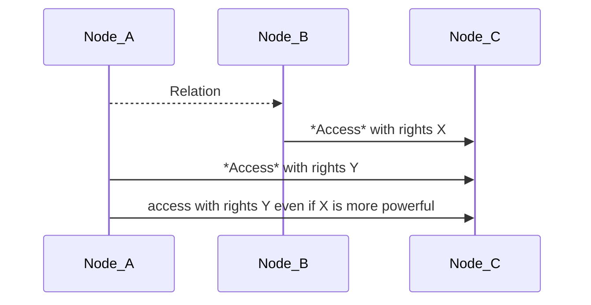

# Modular Notes
At first this project is an attempt to build a notes taking application for desktop, phone, browser etc..  
To make adding implementation on different platforms easier the design of application must be modular.  
But what makes notes taing app a notes taking app, client or server, or both?  
What if all logic that defines what app does is in a client?  
So, here I have 2 ideas:
* User application can be easily created if we have some *core* app that can use existing implementations or installations of backend
* What application does doesn't depend on backend, logic is defined in a *model* in app, backend can only be tuned to suit it better

Obviously, if we go with abstractions we should use its benefits:
* We can have different applications using same backend and same data.
* We can change backend and migrate data to another server since they all implement same API

What user gets from it is independency.  
### independency from backend
User can use cloud server for his data and have a backup on a local machine. He can migrate all data from one server to another, one implementation to another.  

### independency from app
User can have all data in one place and different apps can use only part of it.

## What I need
So I need:
1. Whole application to be separated into highly independent modules.
2. Simple idea how to store pieces of data and connections between them.
3. Implement all modules as simple as possible for a playground and demo.
4. Implement some modules differently (especially UI) to show how it can be customized.

# Status
Storage - file storage, tests via http, code coverage
Server
Client

# Modules of an Application
Here and further frontend application I call App, backend is Backend. Lets dive in those two.

## Top level - ServerAPI
ServerAPI separates App from Backend  
App must have connection config so it would be easy to switch to any other server

## App level - Model, Core, UI
### Model
What does any application do? It provides User with some model of his data. It takes User's data and keeps in some structure, organizes it. **Model** contains that logic.  
### Core
And the logic can be built on some low level system and that is what **Core** is - system providing access to data from App.  
### UI
And User is provided with some interface - **UI**. 

So App consists of several modules:

## Backend level
### Backend.Server
Backend.server - public server - provides authorization, authentication, balancing, caching, and different interfaces: http, https, web socket (+additional functionality?)  
### Backend.storage
Backend.storage - protected server (local?) - provides only access to data with basic indexing.  
### Backend.index
Backend.index - protected server - provides additional index for data, especially for **content**.  

Http servers seems the easiest way to completely separate these modules.  

## Modules
[Storage](docs/STORAGE.md)
[Index](docs/INDEX.md)
[Server](docs/SERVER.md)
[Core](docs/CORE.md)
[Model](docs/MODEL.md)

## Profit
We can choose and develop quite independently any part of chain **ui.model.core.server.storage.index** in application we'd like to make better.  
We can build different applications changing only **ui + model**.  
We can play with any application setting up locally any **server + storage + index** we like.  
We can have different servers for different applications or run all of them on one server or we can have different servers for one application and sync data between them.  

# Basic idea of data model
For now, I explained how I want to split application and separate its parts.  
Second in a [list of needs](#what_i_need) is concept of data. How to store notes, images, audio files, books, videos? How to keep order in that heap? 
On a commputer we have files and folders, lets see what I propose.  

## Objects
There are several basic objects: Node, Relation, Access

### Node
Every data is a *Node*, field **class** tells what.  
User is a *Node*, all it creates is a *Node*.  
It looks like a class or structure with these fields:
* int **id** - unique serial integer being assigned to *Node* on create
* int **author** - id of User who created this *Node*
* string **class** - one word
* string **title** - text
* string **ctype** - MIME content type?
* binary **content** - anything
* int **flags** - some bits, `...<title is encrypted><content is encrypted>`
* string **meta** - json string
* Relation[] **relations**

### Relation
Relation is a connection from *Node* to other *Node* and contained in a *Node*.  
* string **class** - related *Node* class
* int **id** - related *Node* id
* string **local_title** - local synonym for related *Node* that can be used in this *Node*
* number **local_value** - local value for relations that carry a number, for example: weight

*Node* cannot have Relation pointing to same *Node* (itself).  
To build a Relation one needs access to both Nodes.  
*Node* can have multiple Relations - of different kinds: tags, images, etc.  
Relation can have a **local_title** covering title of related *Node*, for example we have a *Node* of class='note' with text: 'It was amazing when _Bobby jumped from the balcony to a snow hill_ below.' and a *Node* of class='image' with that picture and title: 'Bobby is stupid'. We could reference to that picture and have custom title for it, for example 'Bobby the brave' instead of original image title, so **local_title** is literally 'how I want it to be called here'. In another note we could reference to the same picture and call it another way.   
Relation may have a **local_value** - a number if the Relation has idea of it, for example for *Node* of class='note' with text: 'Seen Lamborghini in a street, think it costs about 300 000$' we could have relation to *Node* 'price' with value '300000'. It is because there is a concept 'price' and *Node* 'price in US dollars' and we save price as a separate data. 

Example: *Node* collection of images, and every *Node* image has *Relation* pointing to collection *Node*.

### Access
*Access* is an object containing access rights from one *Node* to another *Node*
* int **idA** - object that has access
* int **idB** - object that is accessed
* int **rights** - bits `<create access from><create access to><delete><write><relate><read>`

#### Direct
*Node* can have *Access* to other *Node*, that's direct access. No transitivity.

Example: *Node* Joe creates *Node* image. Joe will have all rights to that *Node*.

#### Indirect
There is also indirect access, when *Node_A* relates to *Node_B* and *Node_B* has direct access to *Node_C* then *Node_A* has access to *Node_C*, same as *Node_B*. It is kind a roles system. User creates a readonly role and gives it access to some data. If another user can relates to that role, he has access to data.

So if *Node* allows to relate to it, it gives access to all *Nodes* accessible for it.  
Example: TODO зачем проксировать доступ через relation? 

#### Composition of indirect Accesses
If *Node_A* has no direct access and has multiple indirect accesses to *Node_C*, then indirect rights are summarized. In terms of roles it allows to have a basis of roles and combinations of them will create all the diversity of access to data.

#### Composition of direct and indirect Accesses
If *Node_A* has direct access to *Node_C*, then only direct rights are applied.

#### Change Access
To change *Access* between *Node_A* and *Node_B* User needs rights 'create access from' *Node_A* and 'create access to' *Node_B*.  

#### Example
1. Exist *Nodes* of class='user' Joe and Bill
2. Joe created *Node* with image and wants to share it with Bill
3. Bill must create *Access* 'create access from' pointing from Joe to Bill. It will allow Joe to give any access rights he wants. 
Important! 'create access from' is the only *Access* that can be created without any existing rights. It is like subscribing to email spam, if you dont do it you shouldn't receive it.
4. Joe creates *Access* 'read' from Bill to image and now Bill can enjoy it. 

## Questions
C++ compatible API - TODO  
Indexing of data - Backend.index  
Full text search - Backend.index  
Content recognition search - Read all, set recognized tags, find by these tags  
