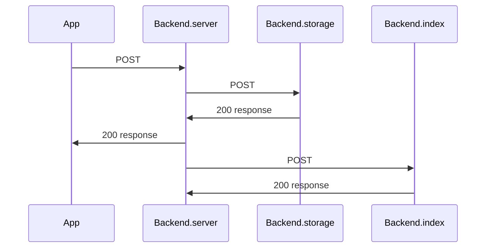
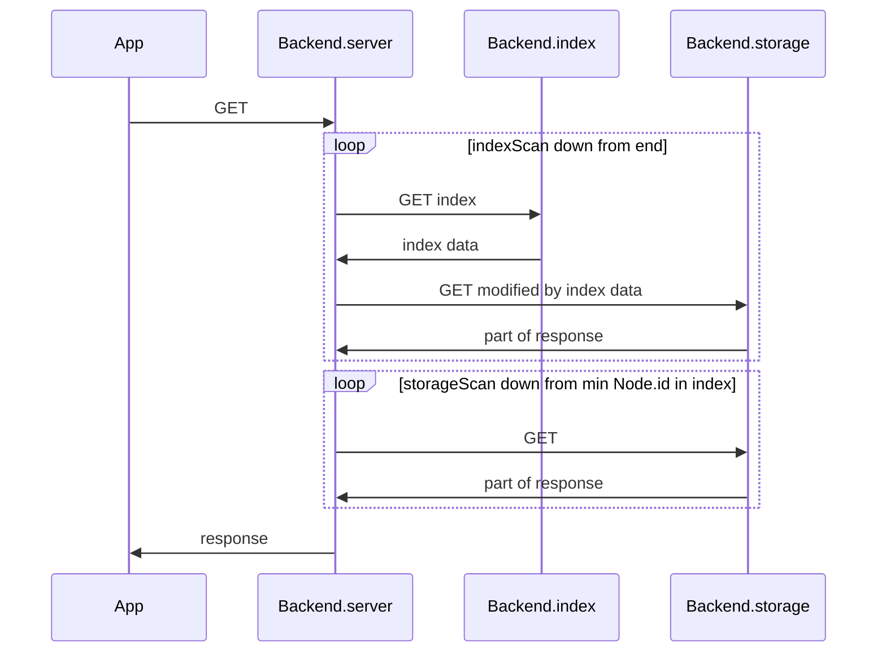
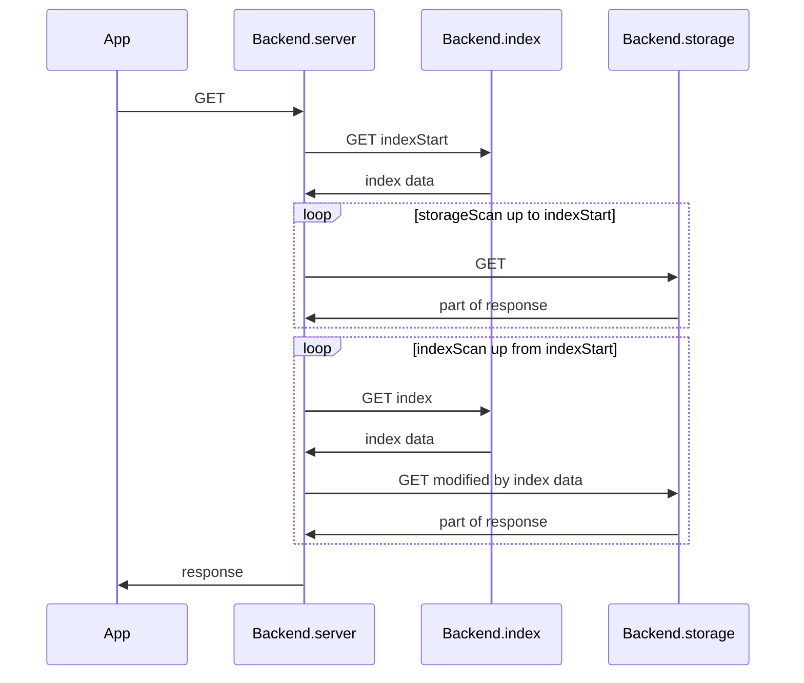

# Server
*Server* provides secure access to internal server on storage from different interfaces, so it has a number of APIs
* http
* https - TODO
* web socket - TODO

Also Server may include Index and use it when proxying requests to Storage.  
TODO May be it will have some additional functionality based on StorageAPI?

# OpenApi
[documentation](../api/server.yaml)

# HTTP REST API
## Access control methods
### Authentication
First and super naive.  
To perform any request Client must provide valid *Access-Token* in header **Cookie** - `Cookie: token=<**Access-Token**>`

### Authorization
Client can authorize himself in any request providing header `Authorization: Basic <base64 encoded **user**:**password**>`, in response he will get *Access-Token* in header `Set-Cookie: token=<**Access-Token**> Secure HttpOnly`
TODO get rid of cookies  
TODO use OAuth or something

### Sessions
Server keeps a list of active sessions by keeping valid *Access-Tokens* for user.  
When *Access-Token* is invalidated session ends.  
To get a list of sessions:

    GET /sessions?user=<**user**>

Returns list of active sessions in response body multipart/form-data

        --aBoundaryString
        Content-Disposition: form-data; name="sessionId"
        Content-Type: text/plain

        2
        --aBoundaryString
        Content-Disposition: form-data; name="description"
        Content-Type: text/plain

        Web client - Safari browser - logged in 01.01.2019T12:00:00Z
        --aBoundaryString--

### Logout
    DELETE /sessions?user=<**user**>&session=<**sessionIds**>

* string **sessionIds** - comma separated session ids. If empty - session is found by provided *Access-Token*

Invalidates *Access-Tokens* and ends corresponding sessions for user.

## Storage methods
### Get Access
Proxied to Storage

### Edit Access
Proxied to Storage

### Get Nodes
If Index present read [this](#on-get-nodes)
#### Ignored parameters
Some parameters in request may be ignored, they will return in field **ignoredParameters** in the end of body  
Example
    Content-Disposition: form-data; name="ignoredParameters"
    Content-Type: text/plain

    titleLike,contentLike

#### Cursor
If Storage says there are more records than returned, Server must add response fields **nextCursor** or **prevCursor** or both.  
They are full query string for next/prev page for request with same filters.

Example
    Content-Disposition: form-data; name="nextCursor"
    Content-Type: application/x-www-form-urlencoded

    idMin=4&classIn=note,image,video&titleLike=regex%3Adog&sort=asc&limit=10

#### Random access
In addition to StorageAPI's method there is option to read with offset
* int **offset**

Server reads from Storage with **limit** = **offset** to find margin *Node* **id** and then reads with original **limit** and modified **idMin** or **idMax** depending on the **sort** option.  
Of course random access is slow and computational heavy, so not recommended to use.

### Edit Node
If Index present read [this](#on-edit-node)

# Index
Of course Storage may have its own indexes, but it should be possible to have external indexing system.  
[IndexAPI full description and examples](INDEX.md)

## Server set index
By default index is turned on for all users, but if it is not needed it can be switched off and Server will ignore it.

    POST /user/**user**?index=<**state**>

* int **user**
* string **state** - 'on' or 'off'

## Indexing
When Index is turned on it starts indexing all new created *Nodes* and indexes all user's *Nodes* from the end to beginning. It is important, because it lets to scan all indexed *Nodes* first and be sure that all not indexed have smaller **id**. TODO What if User searches for someone's *Nodes*, he may not have index? (Idea: Indexing POST /node/**id**?index=<state> - indexes *Node* and all relatives)

## On Edit Node
Server asynchronously updates Index only if Storage responds with success.

## On Get Nodes
If Server has Index it modifies requests to Storage, algorithms differ for scanning in asc and desc order.  
Tip: using external index for optimal performance Server may first find ids and then request Storage for desired fields.

### Descending
Server reads Index, receives array of **id**, modifies original request and reads *Nodes*. Repeats until **limit** is reached or there are no more records in Index. If more records needed Server continues reading Storage with option **idMax** == last *Node* read from Index.

## Ascending
Server gets min **id** in Index by reading Index with **limit** = 1, it will be **indexStart**. Then Server reads Storage from beginning up to this margin, setting **maxId** = **indexStart**, if **limit** is not reached Server continues reading Index, getting ids and reading Storage with modified request.

